<div align="center">



<br />

# Jonathan Adithya Baswara

### learning how systems work, then making them easier to operate

`IT student @ ITS` · `Surabaya, Indonesia` · `building in public`

<br />

[](https://www.linkedin.com/in/jonathanabaswara)
[](mailto:jonathanab03@gmail.com)

</div>

---

## A little about me

I am Jonathan, an Information Technology student at Institut Teknologi Sepuluh Nopember who enjoys understanding what happens behind the interface:

- how Linux services stay alive;
- how networks behave when conditions are imperfect;
- how monitoring turns a vague problem into evidence;
- how security work begins with careful observation; and
- how small tools can remove repetitive operational work.

I am not presenting myself as a finished Cloud or Security Engineer. I am building toward that direction through hands-on practice, documentation, and real systems.

## Current state

```text
┌──────────────────────────────────────────────────────────────┐
│  JONATHAN / FIELD SIGNAL                                     │
│                                                              │
│  learning   Linux · networking · Python · security           │
│  building   monitoring · infrastructure · practical tools    │
│  direction  Cloud · DevOps · Infrastructure · Cybersecurity  │
│  method     inspect → change carefully → verify → document  │
└──────────────────────────────────────────────────────────────┘
```

My current goal is to build strong enough fundamentals to operate systems responsibly, not just recognise the names of tools.

## The kind of work I like

```text
                 OBSERVE
                    │
                    ▼
              UNDERSTAND
                    │
                    ▼
                BUILD
                    │
                    ▼
                VERIFY
                    │
                    └──────► document what happened
```

That loop is more important to me than collecting a long list of technologies.

## A few things that shape me

- I learn best by operating something myself, observing the result, and diagnosing from evidence.
- I care about documentation because future-you is also a user.
- I am interested in the boundary between development and operations: deployment, reliability, monitoring, and security.
- I use AI tools as engineering assistants, while keeping responsibility for understanding and verification.
- I am still learning. The unfinished parts are part of the profile, not something to hide.

## The tools on my bench

<div align="center">


<br /><br />

`Linux` · `Bash` · `Python` · `Docker` · `Prometheus` · `Grafana` · `Git` · `Raspberry Pi`

</div>

## Where I am heading

**Linux and infrastructure → observability → cloud foundations → security operations**

The sequence matters. I want the foundations to connect, rather than treating Cloud and Security as collections of fashionable product names.

## A note from the lab

> I am trying to become the kind of engineer who can look at a running system, form a reasonable hypothesis, test it safely, and explain the result clearly.

<div align="center">

<br />

`still learning · still building · still checking the logs`

<br /><br />

[LinkedIn](https://www.linkedin.com/in/jonathanabaswara) · [GitHub](https://github.com/jonathan-dotcom) · [Email](mailto:jonathanab03@gmail.com)

</div>

---

<sub>Last reviewed: July 2026 · This profile describes my current direction, not a finished career identity.</sub>

<!-- Profile concept: Jonathan / Field Signal. Keep the overview personal; projects are evidence, not the identity. -->
