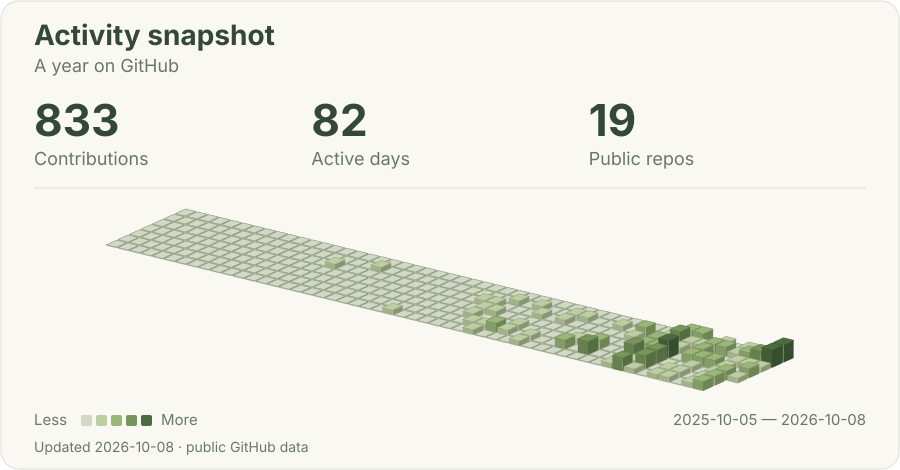

<picture>
  <source media="(prefers-reduced-motion: reduce)" srcset="assets/cloud-lab.png">
  
</picture>

### Jonathan Adithya Baswara

**Focused on DevOps & Cloud Engineering**  
My focus: repeatable deployments, useful monitoring, and secure access.

[LinkedIn ↗](https://www.linkedin.com/in/jonathanabaswara) &nbsp; · &nbsp; [Email ↗](mailto:jonathanab03@gmail.com)

### My infrastructure toolbox

**Linux, containers & hosting**

    

**Networking & access**

 

**Databases & messaging**

  

**Scripting & version control**

  

**Observability**

 

### Selected infrastructure work

- **Web deployment & migration:** Migrated web services from Vercel to an Ubuntu VPS, covering DNS/TLS, release verification, and rollback documentation.
- **Local-first infrastructure:** Worked on a Proxmox-based environment supporting Windows VMs, application services, and device controls, with deployment checks and operator documentation.
- **[UXI-Lite ↗](https://github.com/jonathan-dotcom/uxi-lite):** Built a Raspberry Pi monitoring setup with a Python metrics exporter and containerized Prometheus/Grafana.

### A year of building

<picture>
  <source media="(prefers-color-scheme: dark) and (max-width: 600px)" srcset="assets/activity-dark-mobile.svg">
  <source media="(max-width: 600px)" srcset="assets/activity-light-mobile.svg">
  <source media="(prefers-color-scheme: dark)" srcset="assets/activity-dark.svg">
  
</picture>

Updated daily from my public GitHub profile. Private activity appears only as anonymous counts already shared on GitHub; repository details stay private.
