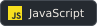
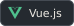
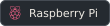

<picture>
  <source media="(prefers-reduced-motion: reduce)" srcset="assets/little-desk.png">
  
</picture>

### Jonathan Adithya Baswara

I build practical tools and tinker with the systems behind them. 
Linux, infrastructure, and automation—with detours into web apps and AI tools.

[LinkedIn ↗](https://www.linkedin.com/in/jonathanabaswara) &nbsp; · &nbsp; [Email ↗](mailto:jonathanab03@gmail.com)

### Things I've worked with

From coursework and team projects to my own self-hosted services.

**Code & apps**

   

**Systems & hosting**

   

**Monitoring & hardware**

  

### A couple of things I've built

- **[UXI-Lite ↗](https://github.com/jonathan-dotcom/uxi-lite)** — Network experience monitoring with a Raspberry Pi sensor, Python, Prometheus, and Grafana.
- **[Auto-grading & plagiarism checker ↗](https://github.com/jonathan-dotcom/Auto-Grading-and-Plagiarism-Detection-Tool-for-myITSClassroom)** — A team capstone for processing myITS Classroom assignments, built with Python and Streamlit.
